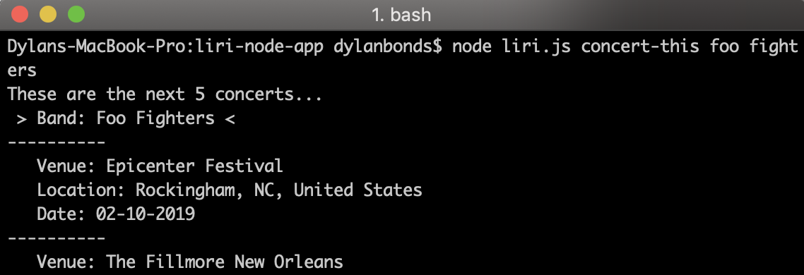
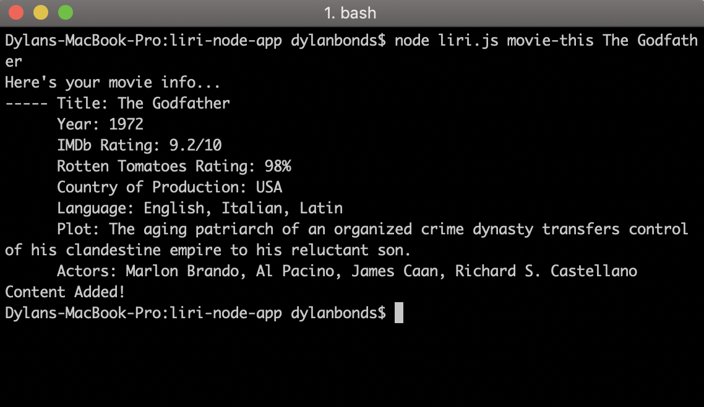

# liri-node-app
Use this node application to find upcoming concerts and get info on songs, movies & tv shows! Your info will be displayed both in your **terminal** and in the **log.txt** file!

## How to use liri:

__Note: To run this app you must have node installed.__
1. After cloning the repo/copying the code, open your terminal and navigate to the file.

1. Type `npm install` to get the required packages.

1. Type `node liri.js [your-command] [your search terms]`

Here are the commands you can use:

  * `concert-this`
  
  * `spotify-this-song`
  
  * `movie-this`
  
  * `do-what-it-says`

## Examples ##
### *concert-this* ### 
Uses the Bandsintown API to show you the date and location of a band's next 5 concerts.
   
   

### *spotify-this-song* ###
Uses the node-spotify-app package to retrieve info and a sample link for any song on Spotify.
   
   

### *movie-this* ###
Uses the OMDb API to give you a load of info on the movie of choice.

   

### *do-what-it-says* ###
Replace the text in random-txt in the format `[your-command],[your search terms]` to execute any of the above command another way.

  

### Happy searching! ###

**Bonus:** What happens when you don't search for anything in particular?

Using the do-what-it-says command you'll get a 1999 classic jam:

Though if you use spotify-this with no search terms, you'll go back to 1992 instead with Ace of Base:

And if you try movie-this without a movie, this is what you'll get:

